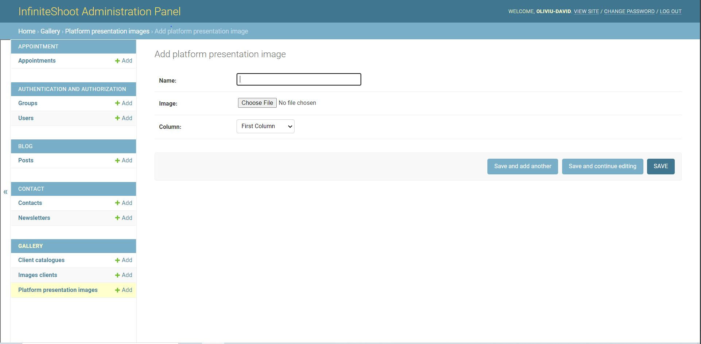
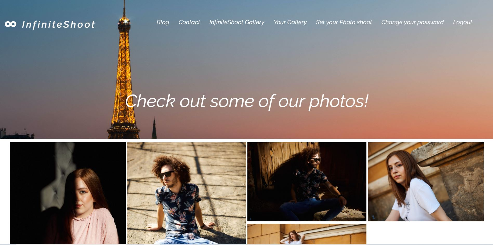
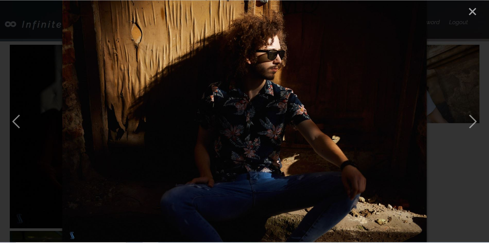
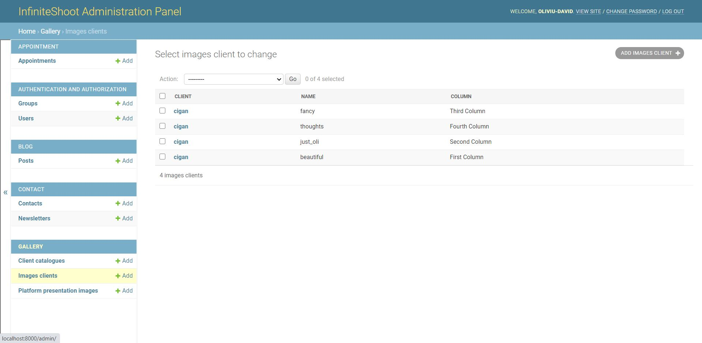
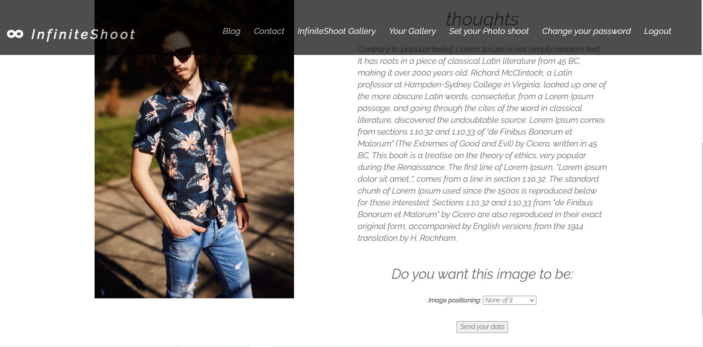
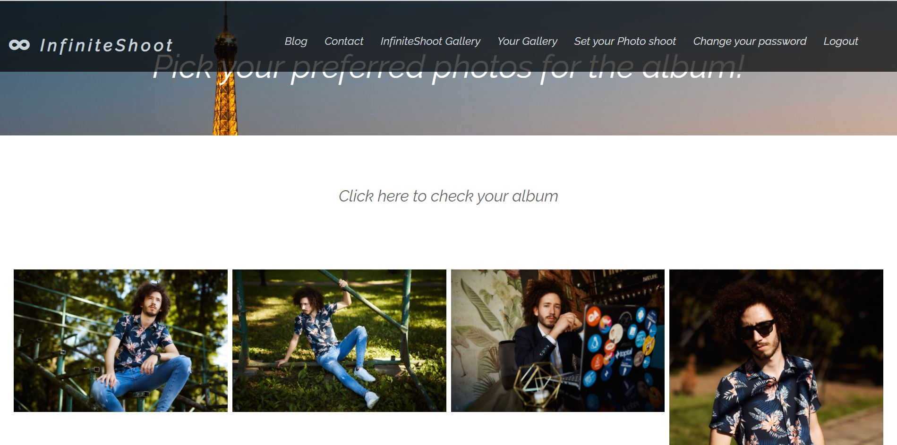
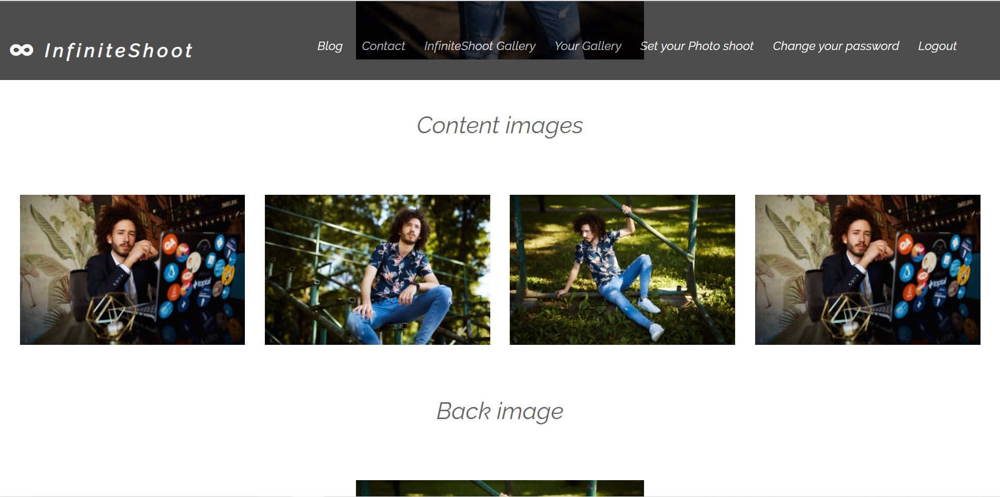
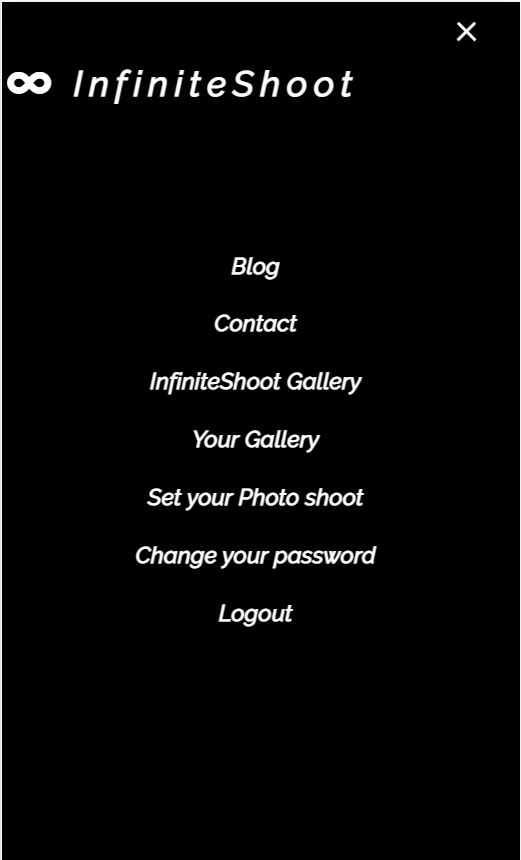
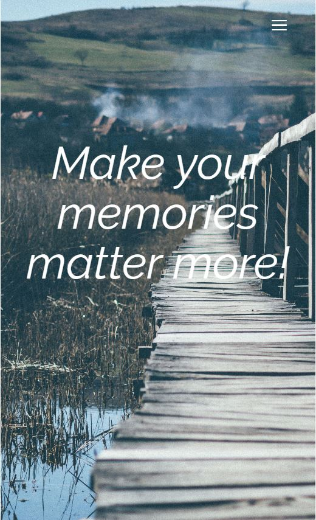
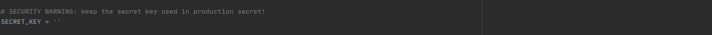

# InfiniteShoot

This webapp represents the concept of a business focused on photo shooting and creating albums for different
events such as graduation, marriage or birthday parties. The webapp is well automated with lots of subsystems
such as authentication, album builder or personal gallery view.


## Backend

In the backend I have 5 databases each of them very important for the functionality and infrastructure of 
the app.

* APPOINTMENT which includes only one table, Appointments
* AUTHENTICATION AND AUTHORIZATION which includes the login system and users table
* BLOG which contains one table, Posts
* CONTACT which includes two tables: Contacts and Newsletters
* GALLERY which contains the customized tables: Client Catalogues, Images Clients, and Platform Presentation 
  Images
  
The databases can be seen below in the administration panel of the webapp:


##### APPOINTMENT

The appointments table includes all the appointments who are requested by the user using a form inside 
the webapp. It includes fields such as phone number, full name and desired date for the photo shoot to happen.
The system is pretty simple, the user is making an appointment for a photo shoot, and because it is assumed 
that the freelancer or business owner already has an appointment system, the app just saves the data into a database so that
the freelancer just has to connect to the person to talk about details such as where should be the photo shoot
or if the date is right. This scenario seems very real because the process of creating interoperability
between the app, and the appointment system would be very time-consuming and money-consuming. That being said,
this solution (interoperability) will pretty much be avoided by both the programmer and freelancer or business owner.

##### How does the form looks in the user view


From the administration panel, the superuser is able to check messages and set them as seen or not and also
set them to accepted or refused. This can be seen in the screenshot below:


##### BLOG

The Posts table from the Blog Database includes all the articles which can be seen in the platform at 
the blog section. From this part of the administration system you can actualise, change or write articles 
very easy through a basic form.

##### Checking the articles from the blog system


##### Adding a new article


##### The way it looks in the UI


##### At the moment you click on the article it opens a detail view with all the details


##### Also, for making the user job simpler, I also implemented a search engine through the articles.


##### CONTACT

This database represents the direct contact to any user who visits the site. It contains 
two main tables. The Contact table contains messages who are sent to the business by a visitor who wants
to offer some feedback, ask something about the business or pretty much say anything he wants.
The message is sent through a form in the UI, more precisely in the Contact section.

##### This is how the form looks like in the UI


##### This is how the administrator sees the messages


On the right side it can be seen the READ field, at the moment you click on a message, and
you read it, you also have a check box below. If you check that check box the message
will appear as seen.

##### This is how the message looks when you open it


The newsletter table works the same way, there is a form in the newsletter section 
which you fill, and the data is stored in the table.


##### GALLERY

This database represents de core field of the webapp. Here is where the images which the business wants
to provide as models appear, here is where the images from the photo shoot are stored and lately listed
in the webapp where the user can check them out. Here is also the place where the album is made by choosing
the pictures you want to provide.

##### Platform presentation images

This table represents images which the business wants to provide as models for future customers or current
customers who are already enrolled for a photo shoot. The table contains only 3 but highly important fields:
Name of the image, The image, and the column where it should be placed in the app. The fact that the admin
is able to position the image where he wants in the page is an important thing so that he is always able
to customise with a specific ease the whole content wherever he wants. This whole process is made from the 
administration panel.

##### This is how the adding image form looks like



##### This is how the added images looks in the views



##### This is how you view a singular image



##### Images Clients

Images Clients represents the table where are stored all the images for all clients. From here, the system
will take the specific images for a user and query them into a template view. This query is also present
in another view from where the user will pick the images he wants for the album.
The table contains fields such as name of the image, the targeted client, the image, thoughts by the
company, etc. 

##### This is how the data looks in the database table



The way images looks in the view is the same here as in the platform presentation images. You as user, can click on any
image and check it closer.

##### Client catalogues

In this table is stored the customizable catalogues for all the users who are in the platform. 
The customization system works simply through a form where the user can choose through different personal images
from the photo shoot. After that, he can exactly pick where he wants the image to be, on the cover, in the content 
or on the back of the album.

##### This is how the user picks where the image should be



##### This is how the views looks for a user who picks an image from personal images



##### This is how the customized album looks



## Frontend

The webapp is 100% responsive, and it includes basic animations realised with CSS3, Javascript and Jquery.

 


## Technologies

The technologies I've used for this project are HTML5, CSS3, Bootstrap, JavaScript, Jquery, Python Django, 
SQL Based Database (sqlite3).

# Future Development

A list with possible and helpful updates that the system may need:

*  Better UX. It is always a good idea to update the UX so that it could be more user-friendly
   and simpler to the user.
 
* Integration with an appointment system for saving more time consumed on calling the client and negotiating
the right time.

* The ability to also get a response from the business or freelancer about the programmed photo shoot. ( When it happens and
, and where ).

## Requirements

* You should have python3 and django (version 3.0.8 or bigger) installed.

## Setup

* Download this repo
* After downloading this repo you have to get a SECRET_KEY from here -> https://djecrety.ir/ and paste
it in the settings.py file from InfiniteShoot folder. (InfiniteShoot/InfiniteShoot/settings.py)
 


* Open cmd or terminal in InfiniteShoot folder and type 
```
    python3 manage.py makemigrations
```

then 

```
    python3 manage.py migrate
```

after that create an admin

```
    python3 manage.py createsuperuser
```

run the app

```
    python3 manage.py runserver
```
* Enjoy