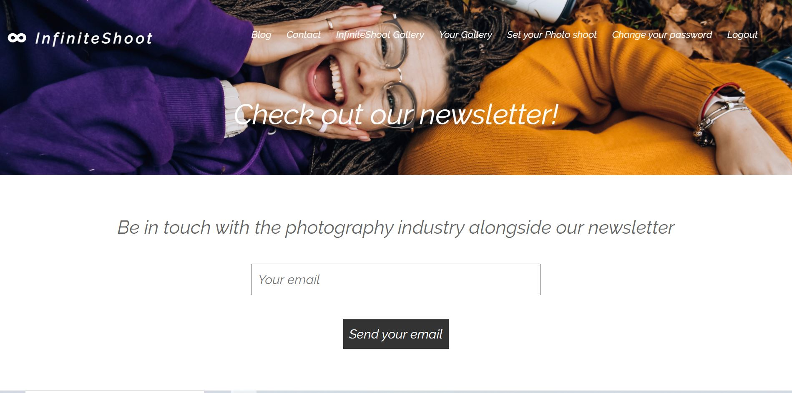

# InfiniteShoot

This webapp represents the concept of a business focused on photo shooting and creating albums for different
events such as graduation, marriage or birthday parties. The webapp is well automated with lots of subsystems
such as authentication, album builder or personal gallery view.

## Backend

In the backend I have 5 databases each of them very important for the functionality and infrastructure of 
the app.

* APPOINTMENT which includes only one table, Appointments
* AUTHENTICATION AND AUTHORIZATION which includes the login system and users table
* BLOG which contains one table, Posts
* CONTACT which includes two tables: Contacts and Newsletters
* GALLERY which contains the customized tables: Client Catalogues, Images Clients, and Platform Presentation 
  Images
  
The databases can be seen below in the administration panel of the webapp:

##### APPOINTMENT

The appointments table includes all the appointments who are requested by the user using a form inside 
the webapp. It includes fields such as phone number, full name and desired date for the photo shoot to happen.
The system is pretty simple, the user is making an appointment for a photo shoot, and because it is assumed 
that the freelancer or business owner already has an appointment system, the app just saves the data into a database so that
the freelancer just has to connect to the person to talk about details such as where should be the photo shoot
or if the date is right. This scenario seems very real because the process of creating interoperability
between the app and the appointment system would be very time-consuming and money-consuming. That being said,
this solution (interoperability) will pretty much be avoided by both the programmer and freelancer or business owner.

##### How does the form looks in the user view

From the administration panel, the superuser is able to check messages and set them as seen or not and also
set them to accepted or refused. This can be seen in the screenshot below:

##### BLOG

The Posts table from the Blog Database includes all the articles which can be seen in the platform at 
the blog section. From this part of the administration system you can actualise, change or write articles 
very easy through a basic form.

##### Checking the articles from the blog system

##### Adding a new article

##### The way it looks in the UI

##### At the moment you click on the article it opens a detail view with all the details

##### Also, for making the user job simpler, I also implemented a search engine through the articles.

##### CONTACT

This database represents the direct contact to any user who visits the site. It contains 
two main tables. The Contact table contains messages who are send to the business by a visitor who wants
to offer some feedback, ask something about the business or pretty much say anything he wants.
The message is sent through a form in the UI, more precisely in the Contact section.

##### This is how the form looks like in the UI

##### This is how the administrator sees the messages

In the right side it can be seen the READ field, in the moment you click on a message and
you read it, you also have a check box below. If you check that check box the message
will appear as seen.

##### This is how the message looks when you open it

The newsletter table works the same way, there is a form in the newsletter section 
which you fill and the data is stored in the table.

