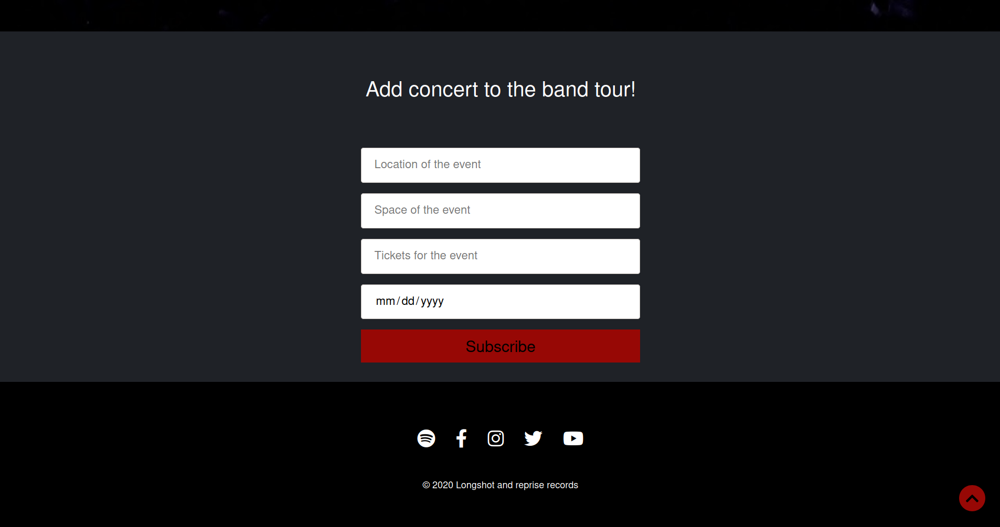

# Longshot

This app represents the presentation website for a band called longshot.


## Backend


This app contains different subsystems such as a newsletter, an administration
board and others. The database behind the system is mysql.

##### Newsletter

The science behind is simple, the user has a form in the webapp where he can either send his email or ignore
the form. If the data is send, it will be saved automatically in a table called newsletter from mysql.

##### How the form looks for the user


##### How the stored data looks in mysql


##### Administration Board with tours and news

The Administration board represents a login system, an admin account will be created for the 
future administrator by the developer. With that account the administrator will have access on a web 
page where he can add news about the band or future concerts.

##### How does the administration system form looks


As I said, the administrator will be able to either add a new concert in a tour or add news about the band
using predefined forms.

##### How does the form for adding news looks


##### How does the form for adding concerts looks



The data added in those forms is later listed in two different sections, news and tours. For the data
to be listed it has to be stored, so after sending the form the data is stored in two different tables, 
tours and news. Only after that is listed in the UI.

##### How does the data for news looks in the UI


##### How does the data for tours looks in the UI


## Frontend

The website is 100% responsive, it's easy to use with a good UX. The wallpaper is changing on every 
section, so I alternated the video wallpaper with the image wallpaper. Along the app I tried to use 
good contrasts between the text and the background. There are also some basic animations 
as well realised with SASS, Javascript and Jquery.

 

## Technologies

The technologies I've used for this project are HTML5, SASS, Bootstrap, Javascript, JQuery,
PHP Laravel and mysql database.

## Future Development

A list with possible and super helpful updates that the system may need:

* I would like to order tickets directly from this platform, without redirecting me to any other webapp
where the purchase is realised.

* As an administrator it would be nice to see all the databases with their contents directly in the admin board without having to go
to mysql. This admin board would be very similar with the one from django, this is 
super helpful when administrating a lot of databases and tables like in cigan_enterprize (...). 

## Requirements

* You should have xampp, php (7.4.3 or bigger), composer and laravel (8.15.0 or bigger) in order to run the app.

## Setup

* Download the repo
* Open the folder structure of the app, open a cmd or terminal and type
```
    php artisan serve
```

The server will automatically run.

* Enjoy
