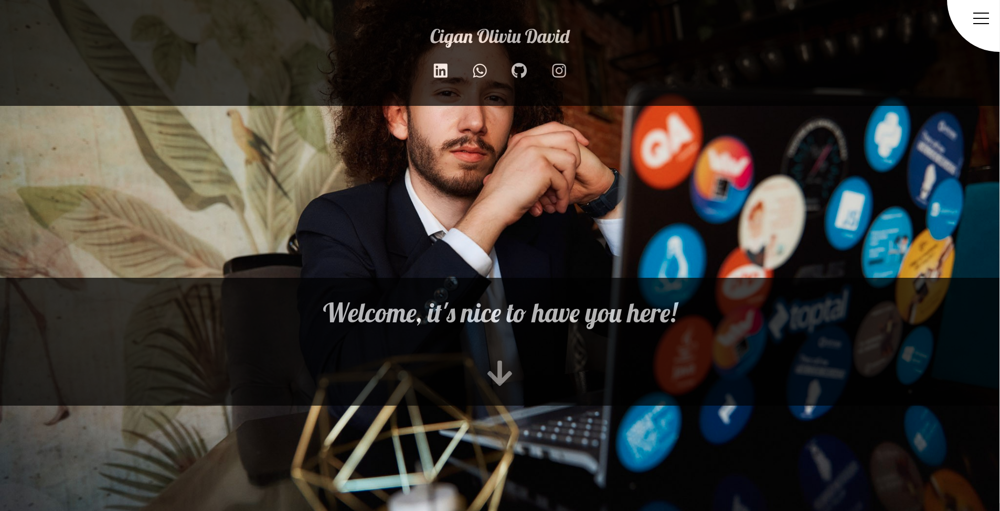
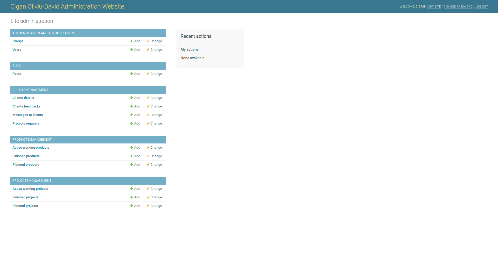
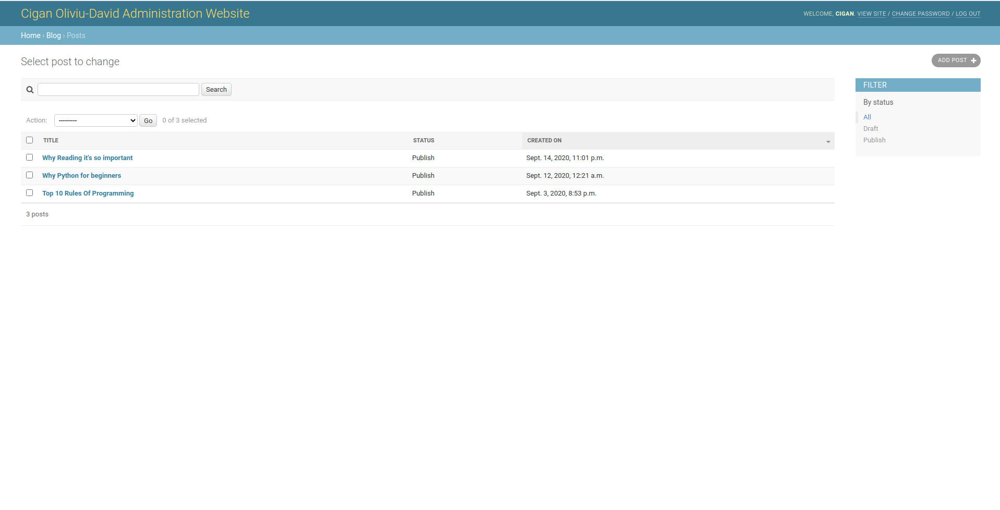
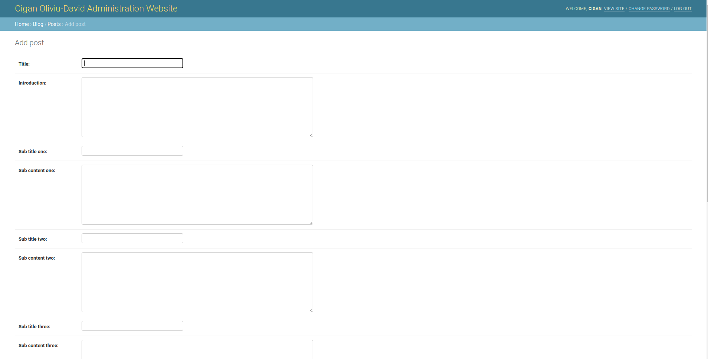
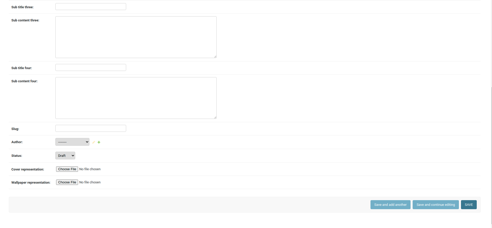
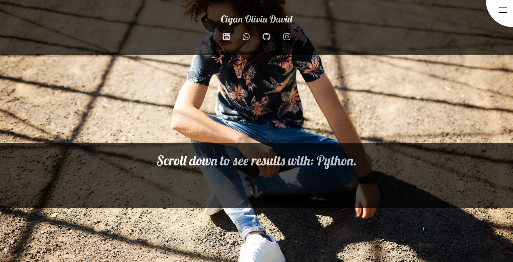
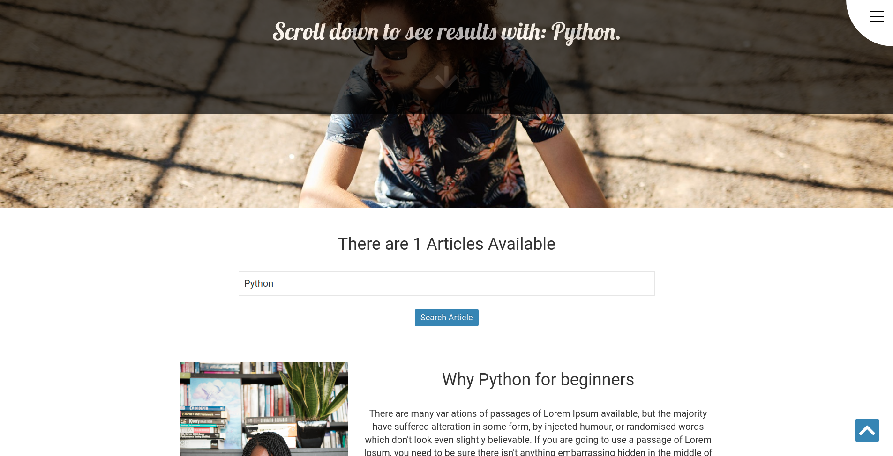
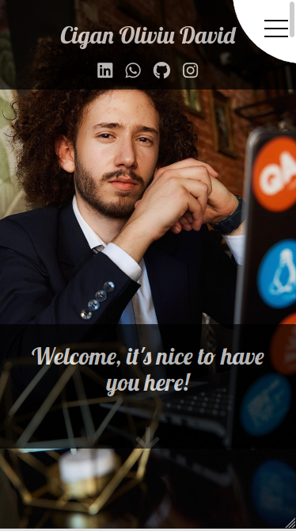
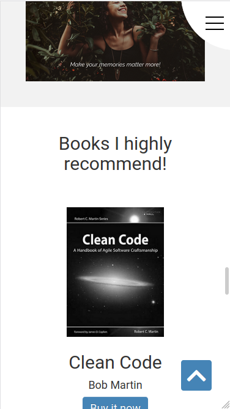
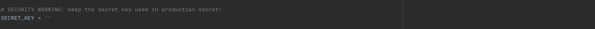

# ciganoliviudavid.com

This app represents my personal website which includes a set of backend
as well as frontend functionalities.



## Backend

In the backend I have a blog system as well as a CRM (Clients 
Relationship Management), both of them are administrated from a control panel. 
The control panel requires authentication from a superuser which is created for a client in the 
development process or later in the maintenance process.

#### The databases and tables can be seen below



##### AUTHENTICATION AND AUTHORIZATION

This database includes the Users or better said the clients which you communicate with through the 
CRM, it is auto-generated by the django web framework and reconfigured to be applicable to the system.  

##### BLOG

The Posts table from the Blog Database includes all the articles which can be seen in the platform
at the personal blog section. From this part of the administration system you can actualise, 
change or write articles very easy through a basic form.

##### Checking the articles from the blog system

 

##### Adding a new article

 

 

##### The way it looks in the UI

 

Based on the Posts table I also created a search engine through the articles so that
the user will be able to go straight to the desired article or information.





The rest of the system, as I said, is part of another project which is a CRM. The version
used here is a plugin, in this way it can be integrated in any Python Django App without problems.
It can also be a plugin to any system but it requires interoperability.

There is a version of this CRM which is not a plugin, is an independent app.
Here is the full documentation of how this webapp works: https://github.com/CiganEnterprise/CustomerRelationshipManagement

In short about the CRM:
 
##### CLIENTSMANAGEMENT

The clients management database contains 4 different tables.
Clients Details which is about different informations about the clients such as the
type of the client, number of finished projects, size of the client and others.

Clients Feedback represents the feedback from the clients, how they fell about
the services the business provides.

Messages to clients represents special emails which are sent to the clients about 
different topics like how the project work is going, about problems who occur
during the project development or others. This messaging system is part of the CRM, 
it is totally independent by any other mailing provider! 

Projects requests represents that part of the system where clients ask about 
new projects that they need. You as business or self employed person are able to
refuse, accept or don't answer if you wish. In the moment you change the status of the
requested project, a feedback will be sent to the user. For more details about how 
the system works here is the documentation: https://github.com/CiganEnterprise/CustomerRelationshipManagement

##### PRODUCTS AND PROJECTS MANAGEMENT

Products management and Projects management represents where is the business working
in the moment you request a project. You can see how many projects or products
does the business have as active working, planned or finished. In this way you as
client can see how does the business go and your chances to get accepted for future
projects. 

## Frontend

The webapp is fully responsive, easy to use with basic animations written in css3
or provided by libraries like AOS (https://michalsnik.github.io/aos/), bootstrap
or font awesome.

I've used vanilla javascript combined with jquery for functionalities like scroll down, 
scroll top, hamburger menu and a digit incrementer.

 

## Technologies

The technologies I've used for this project are HTML5, CSS3, Bootstrap,
JavaScript, Jquery, Python Django, SQL Based Database (sqlite3).

## Future Development

A list with possible and super helpful updates that the system may need:
* The books section should all be automated, all the books put in a database table. From there we talk about
just simple queries in the page. ( This kind of system is implemented in cigan_enterprize -> https://github.com/CiganEnterprise/cigan_enterprize )

* Same thing with the projects who are used as reference in the webapp. All of them should be put in 
a database table where there should be only queries in the main page. ( Again, this kind of system is
implemented in cigan_enterprize -> https://github.com/CiganEnterprise/cigan_enterprize)

## Requirements

* You should have python3 and django (version 3.0.8 or bigger) installed.

## Setup

* Download this repo
* After downloading this repo you have to get a SECRET_KEY from here -> https://djecrety.ir/ and paste
it in the settings.py file from PersonalWebApp folder. (ciganoliviudavid/PersonalWebApp/settings.py)
 


* Open cmd or terminal in ciganoliviudavid folder and type 
```
    python3 manage.py makemigrations
```

then 

```
    python3 manage.py migrate
```

after that create an admin

```
    python3 manage.py createsuperuser
```

run the app

```
    python3 manage.py runserver
```
* Enjoy