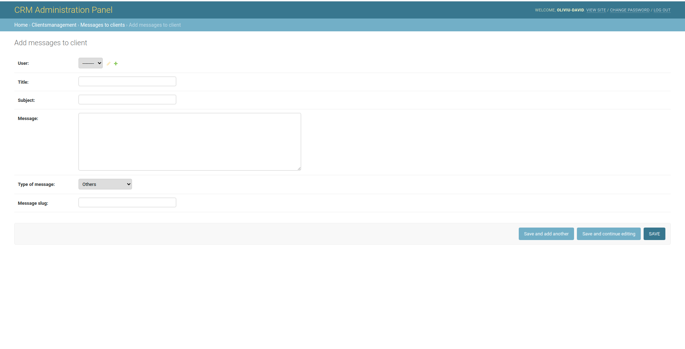
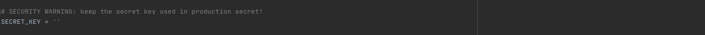

 # CustomerRelationshipManagement

This CRM represents my way of administrating clients and the projects they
request. It includes an authentication system into the platform, projects 
request possibilities, real time check of the status of the working project,
included mailing system for a quicker intercommunication between client and
business owner and others.


## Backend

Every part of the webapp is administrated from a control panel as shown
below.


##### AUTHENTICATION AND AUTHORIZATION

This database all the clients of the business with basic details needed
for the authentication system. It includes last_login, last_logout and others.

A reset password system is also present, it works by sending an email to the
user with a link to the reset password form.

##### CLIENTSMANAGEMENT

The clients management database includes four different tables..

##### Clients details

This table includes different informations about any specific client who
has an account in the platform. Information like size of the client, type of the client,
number of finished, proposed or planned projects even the projects who are
in progress of development. It also includes a profile image, a short description,
email, phone number, social media presence and personal website. The structure can be seen
below.


This information is used not only for the business but also to create 
a profile of the client in the UI through CRUD operations.


All this information is introduced by the client itself through a form. He
is also the one who can actualise all this data from a simple form.


This part of the webapp also includes a password change system which simply
redirects the user to a form for changing the password.

##### Clients feedbacks 

This table represents messages from the clients about how the project is
working after it was delivered but not only that. It is also about any comments
that the user wants to make about services, workflow, quality, pretty much
everything the business is responsible. The feedback is sent through a form
directly in the database where it can be read by the business owner or 
platform administrator.


##### Messages to clients

 This table represents the big part of the mailing system from the platform.
 Here, the business owner is able to write any mails to any client about specific
 topics such as project references, workflow references or others.
 


All the mails who are sent to the user are just crud operations in the UI with specific 
filters.


As it can been seen there are 5 different filters and those are all messages, last messages,
messages, about projects, messages about workflow and other messages. The user (client) can go to any 
of those elements from the submenu to get quicker to the messages he wants to read or check.

As a client you also have the possibility to request a project to the business or to the freelancer
who is owning the platform. You can do that very simple just by filling all required fields from this 
form.

  

After sending the request, the business or the freelancer is able to analyse it directly from the
database. After doing so they have the possibility to either accept, refuse, or let the user
wait for a response. The moment when the owners change the project status, it will be automatically 
visible to the client as well so that he will know the state of the requested project.

What the business owner will see

  

What the client will see


Also the infos about the user will adapt so it can be seen there is one proposed project. In the moment
the business owner accepts the project, a copy of all the infos will be created in a table called planned
projects from  PROJECTSMANAGEMENT database. Here is where the management of the projects will take place.

##### PROJECTSMANAGEMENT

##### Planned projects

Here is the first place where the information about the accepted project will be moved. This table will
also include additional information like the price asked, working status and deadline. Again, all this
information will be actualised to the client as well so that he will be into a continuous 
touch with the business owner without losing time with phone calls, questions about the project status
or how things are going.

Here is the place where are all the planned projects the business has, including the ones who are currently
in the development process. They can be filtered very easy by the working status field, the ones who have
the attribute "On Queue" are the ones that the business did not started to work at yet.


##### Currently working at

In the moment the status is changed to currently working at, the project 
information is moved to a table called active working projects. Here new fields are added such as
Percent done, or ready for delivery. Again, the business owner is able to feed the client with
continuous data about how the project work is going, telling him exactly how much of the project still
needs to be done.

What the business owner will see


What the client will see


##### Finished projects

After the ready to delivery button is checked, the system will transfer all the required information
in a table called finished projects. Also all the data which identifies with this project will be deleted
from the previous three tables, Planned projects, Currently working at projects and requested projects.
The only information about the project will be stored here, so as any other project which was finished
by the business. 

What the business owner will see


What the client will see


The need of doing this was keeping the working tables as simple as possible, I wanted the system
to be easy to work with and keeping old data in those tables would be just a waste. Moving them 
in a new table which includes all the finished projects seemed to me the best choice at least for now.

The system has it's pros and cons but as a general view and at least for now it seems to work very well
without problems being created on a solid platform.

As it can be seen below, the data from other tables was deleted but it's present in the finished table.


The products section represents the products where the company is working so that the client would
know where the business is going with the ideologies as a brand. That section only contains a list 
of the products who are planned by the business, the products where the business is working and the 
products who are finished and are free to purchase. It represents just some queries from the database
using the django ORM.

## Technologies

The technologies I've used here are HTML5, CSS3, Javascript, Jquery, Bootstrap,
Python Django, SQL Based Database (sqlite3).

## Future Development

A list with possible and super helpful updates that the system may need:

* It may be nice to have the possibility to buy products directly from this CRM as long as I can see
them or at least send a request for getting a product. A special request line which asks about buying 
a product even tough is not finished if the ask for it is bigger than the offer. This subsystem should be
also administrated from the control panel. 

## Requirements

* You should have python3 and django (version 3.0.8 or bigger) installed.

## Setup

Because we talk about a plugin, you need to have a predefined app (django based app preferably) to
implement it. If your app is not django based then it requires interoperability which is subjective for
every project in part.

If you have a django based app where you want to plugin the CRM you have to follow the next steps:

* Download this repo
* Copy all the folders from the CRMPlugin folder except ClientsManagementSystem
* Install the apps in INSTALLED_APPS list from your settings.py file
* Make sure you have the next lines of setup code in your settings.py
```
    LOGIN_REDIRECT_URL = '/client/home'
    
    LOGOUT_REDIRECT_URL = '/accounts/login'
    
    EMAIL_BACKEND = "django.core.mail.backends.filebased.EmailBackend"
    
    EMAIL_FILE_PATH = os.path.join(BASE_DIR, "sent_emails")
```
* The home url for the CRM is
```
    clients-management-system/
```

* Open cmd or terminal in CustomerRelationshipManagement folder and make the migrations 
```
    python3 manage.py makemigrations
```

then migrate

```
    python3 manage.py migrate
```

Because it is assumed you already have an admin account, you only have to run the app

```
    python3 manage.py runserver
```

* Enjoy

If you do not want to integrate the plugin in an app, you can run it as an independent app but with 
the index view missing which means the main url ( '/' ) is not rendered. If that's your choice, 
follow the next steps:

* Download this repo

* After downloading this repo you have to get a SECRET_KEY from here -> https://djecrety.ir/ and paste
it in the settings.py file from CustomerRelationshipManagement folder. (CustomerRelationshipManagement/CustomerRelationshipManagement/settings.py)
 


* Open cmd or terminal in CustomerRelationshipManagement folder and type 
```
    python3 manage.py makemigrations
```

then 

```
    python3 manage.py migrate
```

after that create an admin

```
    python3 manage.py createsuperuser
```

run the app

```
    python3 manage.py runserver
```

* The home url for the CRM is
```
    clients-management-system/
```

* Enjoy
